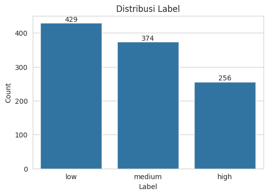
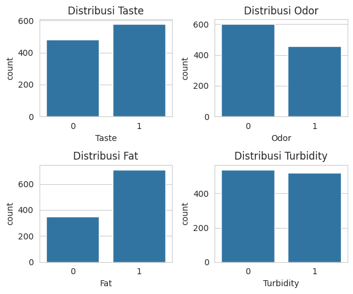
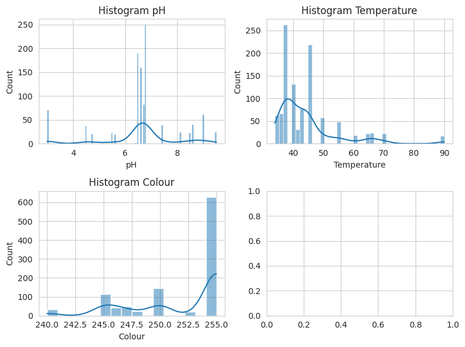
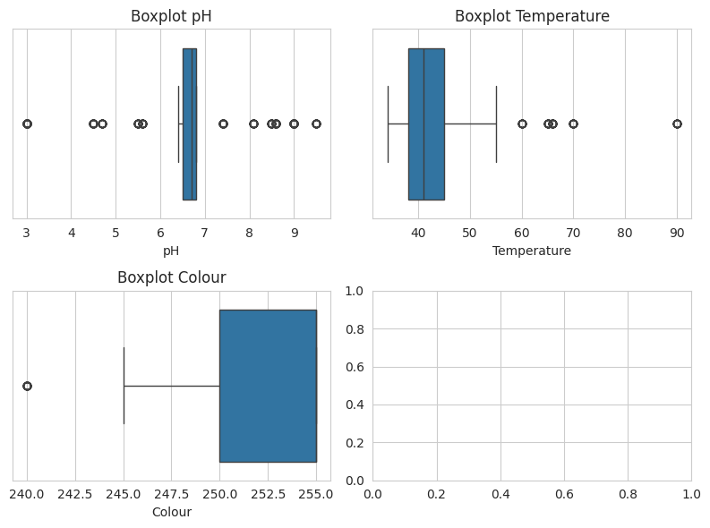
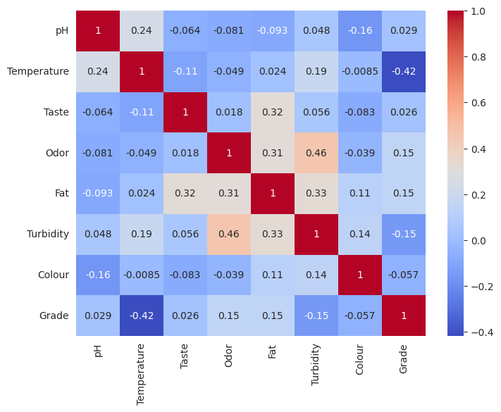
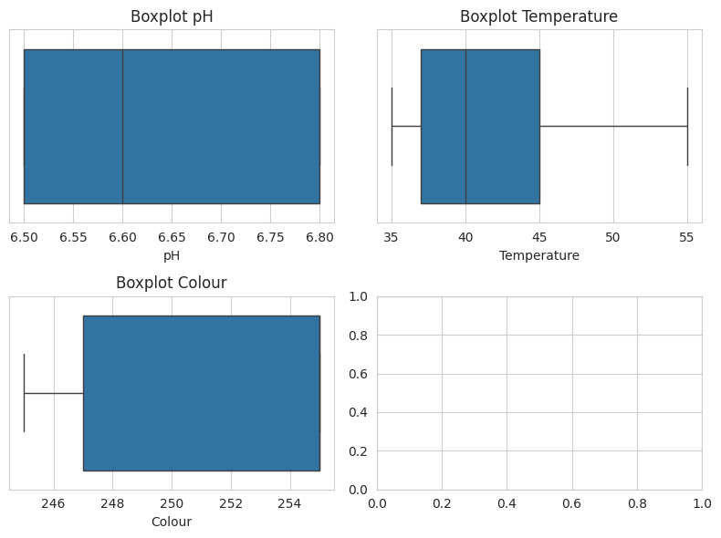
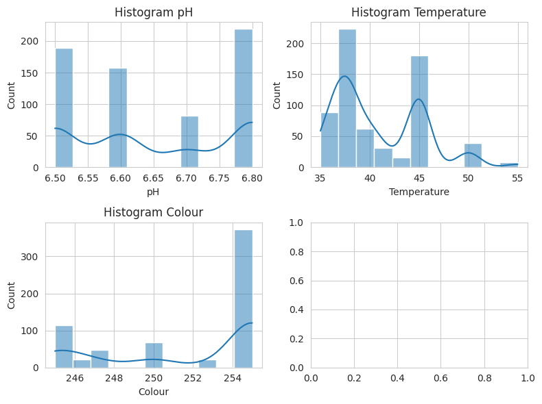
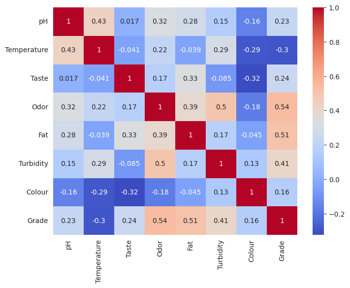
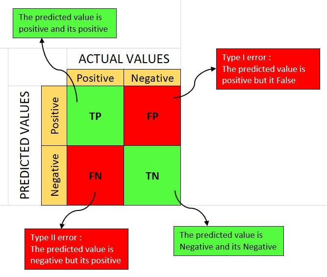
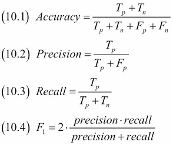

# Laporan Proyek Machine Learning - Muhammad Bagus Adi Prayoga

## Domain Proyek

Susu sapi adalah komponen penting dalam rantai pangan manusia. Memastikan kualitas susu yang tinggi adalah suatu keharusan untuk memenuhi standar keamanan dan gizi yang diharapkan oleh konsumen. Standar kualitas yang ketat diterapkan dalam industri susu untuk memastikan produk yang dihasilkan memenuhi persyaratan yang ditetapkan.

Namun, kualitas susu dapat bervariasi dipengaruhi oleh sejumlah faktor, termasuk kesehatan sapi, kondisi lingkungan, dan proses produksi. Variabilitas ini dapat menyebabkan fluktuasi dalam kualitas susu, dan dalam beberapa kasus, produk mungkin tidak memenuhi standar yang diinginkan.

Pengklasifikasian kualitas susu sapi saat ini umumnya masih bergantung pada metode organoleptik (penilaian melalui indra manusia seperti bau, rasa, dan warna). Metode ini cenderung subjektif dan tidak konsisten, menyebabkan penilaian kualitas yang kurang akurat.

Penggunaan teknik analitik prediktif, seperti Machine Learning, dapat menjadi solusi untuk mengklasifikasikan kualitas susu sapi secara lebih objektif dan konsisten. Model Machine Learning dapat menentukan kualitas susu berdasarkan karakteristiknya, seperti pH, suhu, warna, dan lain sebagainya. Pendekatan ini diharapkan dapat meningkatkan konsistensi dan akurasi dalam penilaian kualitas susu sapi, serta membantu dalam meningkatkan efisiensi proses evaluasi.


## Business Understanding

### Problem Statements

Berdasarkan pemahaman atas domain proyek yang telah diuraikan sebelumnya, berikut adalah problem statements yang teridentifikasi:
- Bagaimana langkah-langkah pre-processing data yang optimal dalam pengembangan model Machine Learning untuk melakukan klasifikasi kualitas susu sapi?
- Bagaimana kita dapat merancang dan mengembangkan model Machine Learning yang mampu mengklasifikasikan kualitas susu sapi secara efektif?
- Bagaimana cara yang tepat untuk mengevaluasi kinerja model Machine Learning yang telah dibangun dalam mengklasifikasikan kualitas susu sapi?

### Goals

Berdasarkan problem statements yang telah diidentifikasi sebelumnya, berikut adalah beberapa goals dari proyek ini:
- Mengembangkan alur pre-processing data yang efisien dan efektif untuk mempersiapkan data masukan bagi model Machine Learning guna klasifikasi kualitas susu sapi.
- Membangun model Machine Learning yang mampu mengklasifikasikan kualitas susu sapi dengan tingkat akurasi minimal 90% dan F1-score minimal 0.9.
- Melakukan evaluasi menyeluruh terhadap kinerja model Machine Learning yang telah dibangun untuk menentukan model terbaik yang memenuhi standar performa yang ditetapkan.

### Solution Statements

Berdasarkan goals di atas, maka diperoleh beberapa solution statement untuk menyelesaikan masalah tersebut, yaitu:
- Melakukan persiapan data untuk memastikan kesiapan dalam penggunaan dalam pembuatan model machine learning. Ini mencakup beberapa tahapan seperti penanganan missing value, outliers, feature engineering, pemisahan data, serta standarisasi.
- Mengembangkan model machine learning yang efektif dengan langkah-langkah berikut:
	- Membandingkan baseline model menggunakan library LazyPredict dan mengevaluasi kinerjanya.
	- Memilih tiga model machine learning dengan akurasi dan F1-score tertinggi dari hasil evaluasi.
	- Membangun model Voting Classifier yang menggabungkan tiga baseline model terbaik sebelumnya.
- Melakukan evaluasi terhadap setiap model menggunakan teknik cross validation, confusion matrix, serta berbagai metrics performance seperti akurasi, presisi, recall, dan F1-Score untuk menilai kinerja dan kemampuan prediktifnya secara menyeluruh.


## Data Understanding

Datasets yang digunakan pada kasus ini adalah dataset yang dikumpulkan secara manual melalui pengamatan yang bersumber dari [Kaggle - Milk Quality Prediction](https://www.kaggle.com/datasets/cpluzshrijayan/milkquality). Datasets ini berisi 1,059 baris dan 8 kolom, berikut adalah deskripsi dari masing-masing kolomnya:
- **pH:** Tingkat keasaman susu (ideal: 6.25 - 6.90).
- **Temperature:** Suhu susu (ideal: 34°C - 45.20°C).
- **Taste:** Rasa susu (0: Buruk, 1: Baik).
- **Odor:** Bau susu (0: Buruk, 1: Baik).
- **Fat:** Kandungan lemak dalam susu (0: Rendah, 1: Tinggi).
- **Turbidity:** Tingkat kekeruhan susu (0: Rendah, 1: Tinggi).
- **Colour:** Warna susu (kisaran: 240 - 255).
- **Grade (Target Variable):** Kualitas susu ("Low" - Buruk, "Medium" - Sedang, "High" - Baik).

### Descriptive Statistics

Tabel 1. Deskripsi Statistik Data

|       |         pH |   Temperature |       Taste |        Odor |         Fat |   Turbidity |     Colour |
|:------|-----------:|--------------:|------------:|------------:|------------:|------------:|-----------:|
| count | 1059       |     1059      | 1059        | 1059        | 1059        | 1059        | 1059       |
| mean  |    6.63012 |       44.2266 |    0.546742 |    0.432483 |    0.671388 |    0.491029 |  251.84    |
| std   |    1.39968 |       10.0984 |    0.498046 |    0.495655 |    0.46993  |    0.500156 |    4.30742 |
| min   |    3       |       34      |    0        |    0        |    0        |    0        |  240       |
| 25%   |    6.5     |       38      |    0        |    0        |    0        |    0        |  250       |
| 50%   |    6.7     |       41      |    1        |    0        |    1        |    0        |  255       |
| 75%   |    6.8     |       45      |    1        |    1        |    1        |    1        |  255       |
| max   |    9.5     |       90      |    1        |    1        |    1        |    1        |  255       |

Beberapa informasi yang dapat diambil dari descriptive statistics diatas adalah:
- Datasets ini terdiri dari 1,059 baris dan 8 kolom
- Tidak ada missing values pada datasets ini
- Ada indikasi outlier pada kolom pH dan Temperature
- Mayoritas sampel memiliki rasa "Baik", bau "Buruk", kandungan lemak "Tinggi", tingkat kekeruhan "Rendah", dan kualitas "Rendah".

### EDA: Uni-Variate Analysis



Gambar 1. Distribusi Label
<br>



Gambar 2. Distribusi Fitur Kategori
<br>



Gambar 3. Histogram Fitur Numerik
<br>



Gambar 4. Boxplot Fitur Numerik
<br>

Informasi yang didapatkan dari uni-variate analysis:
- **Distribusi label yang tidak seimbang** dapat menghasilkan model yang memprediksi "Low" lebih sering, meskipun kualitas susu sebenarnya "Medium" atau "High".
    - Salah satu solusi untuk hal ini jika dimungkinkan adalah dengan menggunakan teknik sampling seperti SMOTE
    - Menggunakan model klasifikasi yang dapat bekerja pada distribusi data yang tidak seimbang seperti Random Forest atau SVM
- Distribusi fitur kategorikal sudah cukup bagus, namun pada fitur Fat terdapar perbedaan jumlah yang sangat banyak
- **Terdapat outlier pada semua fitur numerical**, sehingga perlu dilakukan outlier handling

### EDA: Multi-Variate Analysis

Sebelum melakukan multi-variate analysis, dilakukan label encoding pada kolom **Grade** dengan menggunakan metode ordinal encoding. Hasil dari label encoding menunjukkan:
- "Low" = 0
- "Medium" = 1
- "High" = 2

Selanjutnya, dilakukan visualisasi heatmap korelasi antar fitur. Hasil dari visualisasi heatmap korelasi menunjukkan:



Gambar 5. Heatmap Korelasi
<br>

Informasi yang didapatkan dari multivariate analysis:
- Kolom **Grade** memiliki **korelasi positif** yang kecil dengan kolom **Odor** dan **Fat**
- Kolom **Grade** memiliki **korelasi negatif** yang kecil dengan kolom **Turbidity**
- Kolom **Grade** memiliki **korelasi negatif** yang sedang dengan kolom **Temperature**


## Data Preparation

### Outlier Handling

Beberapa fitur dalam dataset, seperti **pH**, **Temperature**, dan **Colour**, memiliki outlier. Outlier adalah data yang nilainya jauh dari nilai mayoritas data. Outlier dapat menyebabkan model machine learning menjadi tidak akurat.

Oleh karena itu, outlier handling dilakukan untuk menghilangkan outlier dari dataset. Outlier handling dilakukan dengan menggunakan **metode IQR (Interquartile Range)**.

Berikut adalah rumus IQR:
- Q1: 25th percentile (nilai tengah 25% data terkecil)
- Q3: 75th percentile (nilai tengah 25% data terbesar)
- IQR: Q3 - Q1 (selisih antara Q3 dan Q1)
- Lower Bound: Q1 - (1.5 * IQR) (batas bawah data normal)
- Upper Bound: Q3 + (1.5 * IQR) (batas atas data normal)
- Outlier: Data yang nilainya kurang dari Lower Bound atau lebih dari Upper Bound

Hasil dari outlier handling menunjukkan:
- Data sebelum outlier handling: 1.059 baris
- Data setelah outlier handling: 648 baris
- Total outlier yang dihilangkan: 411 baris
- Rincian outlier yang dihilangkan:
  - pH: 379 baris
  - Temperatur: 103 baris
  - Warna: 32 baris

Berikut adalah visualisasi data hasil setelah outlier handling:


Gambar 6. Boxplot Fitur Numerik Setelah Outlier Handling
<br>



Gambar 7. Histogram Fitur Numerik Setelah Outlier Handling
<br>



Gambar 8. Heatmap Korelasi Setelah Outlier Handling
<br>

### Splitting Data

Data yang sudah bersih kemudian di-split menjadi dua bagian, yaitu:
- **Training Set**: 80% dari total data
- **Testing Set**: 20% dari total data

Tujuan dari splitting data adalah untuk mempersiapkan data yang akan digunakan untuk melatih model machine learning dan data yang akan digunakan untuk menguji model machine learning.

### Feature Scaling (Standardization)

Feature scaling dilakukan untuk menstandarisasi nilai-nilai dari fitur-fitur numerik dalam dataset. Hal ini dilakukan untuk memastikan bahwa semua fitur memiliki skala yang sama. Metode yang digunakan adalah **StandardScaler**.

StandardScaler mengubah distribusi data sehingga memiliki mean 0 dan standar deviasi 1. Hal ini dilakukan dengan mengurangi setiap nilai dengan mean dan kemudian membaginya dengan standar deviasi.

## Modeling

Proses pemodelan dibagi menjadi beberapa tahapan, yaitu:
- **Baseline Model**: Melakukan pemodelan menggunakan beberapa algoritma machine learning dengan bantuan library LazyPredict.
- **Model Selection**: Memilih tiga model machine learning dengan akurasi dan F1-score tertinggi dari hasil evaluasi.
- **Model Development**: Membangun model Voting Classifier yang menggabungkan tiga baseline model terbaik sebelumnya.

Baseline model dibangun menggunakan library LazyPredict. Library ini digunakan untuk membandingkan performa dari berbagai algoritma machine learning dengan cepat. Baseline model yang akan dipilih adalah **model traditional machine learning**. Berikut adalah hasil dari baseline model:

Tabel 2. Hasil Evaluasi Baseline Model
| Model                         |   Accuracy |   Balanced Accuracy | ROC AUC   |   F1 Score |   Time Taken |
|:------------------------------|-----------:|--------------------:|:----------|-----------:|-------------:|
| LGBMClassifier                |   1        |            1        |           |   1        |    0.232165  |
| XGBClassifier                 |   1        |            1        |           |   1        |    0.073621  |
| DecisionTreeClassifier        |   1        |            1        |           |   1        |    0.0174434 |
| ExtraTreesClassifier          |   1        |            1        |           |   1        |    0.136188  |
| RandomForestClassifier        |   1        |            1        |           |   1        |    0.181055  |
| LabelPropagation              |   1        |            1        |           |   1        |    0.0340152 |
| LabelSpreading                |   1        |            1        |           |   1        |    0.0485413 |
| BaggingClassifier             |   1        |            1        |           |   1        |    0.0483181 |
| ExtraTreeClassifier           |   0.992308 |            0.994949 |           |   0.992314 |    0.0152066 |
| QuadraticDiscriminantAnalysis |   0.992308 |            0.994949 |           |   0.992314 |    0.0153189 |
| SVC                           |   0.992308 |            0.966667 |           |   0.992141 |    0.0195484 |
| KNeighborsClassifier          |   0.992308 |            0.966667 |           |   0.992141 |    0.0258548 |
| LogisticRegression            |   0.984615 |            0.960494 |           |   0.984492 |    0.0539668 |
| SGDClassifier                 |   0.984615 |            0.960494 |           |   0.984492 |    0.0190806 |
| LinearSVC                     |   0.984615 |            0.960494 |           |   0.984492 |    0.0443156 |
| CalibratedClassifierCV        |   0.984615 |            0.960494 |           |   0.984492 |    0.104081  |
| PassiveAggressiveClassifier   |   0.976923 |            0.956566 |           |   0.976772 |    0.0179486 |
| Perceptron                    |   0.969231 |            0.92211  |           |   0.968606 |    0.0222425 |
| AdaBoostClassifier            |   0.876923 |            0.905724 |           |   0.875516 |    0.115924  |
| LinearDiscriminantAnalysis    |   0.861538 |            0.861728 |           |   0.856756 |    0.0239906 |
| NearestCentroid               |   0.838462 |            0.852189 |           |   0.84233  |    0.0230031 |
| GaussianNB                    |   0.884615 |            0.807744 |           |   0.887382 |    0.0198004 |
| RidgeClassifier               |   0.869231 |            0.787542 |           |   0.865791 |    0.0209899 |
| RidgeClassifierCV             |   0.861538 |            0.754209 |           |   0.856306 |    0.0170121 |
| BernoulliNB                   |   0.784615 |            0.590572 |           |   0.776403 |    0.0185149 |
| DummyClassifier               |   0.507692 |            0.333333 |           |   0.341915 |    0.0158775 |

Selanjutnya, model selection dilakukan dengan memilih tiga traditional machine learning model dengan akurasi dan F1-score tertinggi. Tiga model yang dipilih adalah:
  - **DecisionTreeClassifier**: Akurasi = 1.00, F1-Score = 1.00
    - **Kelebihan**:
      - **Interpretability**: Struktur pohon keputusan model ini mudah dipahami dan memungkinkan Anda untuk melacak bagaimana fitur memengaruhi prediksi akhir.
      - **Cepat untuk dilatih**: Membutuhkan waktu training yang singkat dibandingkan dengan model lain.
      - **Tidak memerlukan scaling data**: Model ini tidak terlalu sensitif terhadap scaling fitur.
    - **Kekurangan**:
      - **Overfitting**: Model ini dapat menghafal data training terlalu baik dan tidak dapat digeneralisasi dengan baik ke data baru.
      - **Variansi tinggi**: Model ini rentan terhadap perubahan kecil dalam data training, yang dapat menyebabkan prediksi yang berbeda.
      - **Biased learning**: Model ini dapat lebih condong ke fitur kategoris dengan banyak level dibandingkan fitur numerik atau kategoris dengan level sedikit.
  - **SVC**: Akurasi = 0.99, F1-Score = 0.99
    - **Kelebihan**:
      - **Efektif untuk data dengan dimensi tinggi**: Model ini dapat bekerja dengan baik pada data dengan banyak fitur.
      - **Kinerja yang baik pada data non-linear**: Model ini dapat menangani data yang memiliki hubungan non-linear antara fitur dan label.
      - **Mencegah overfitting dengan margin classification**: Model ini secara eksplisit mencari hyperplane yang memisahkan kelas dengan margin terbesar, mengurangi overfitting.
    - **Kekurangan**:
      - **Kurang cocok untuk dataset besar**: Model ini memerlukan waktu training yang lama untuk dataset besar.
      - **Sensitif terhadap noise**: Model ini dapat menghasilkan hasil yang buruk jika terdapat noise dalam data.
  - **KNeighborsClassifier**: Akurasi = 0.99, F1-Score = 0.99
    - **Kelebihan**:
      - **Sederhana**: Model ini mudah dipahami dan diimplementasikan.
      - **Non-parametrik**: Model ini tidak membuat asumsi tentang distribusi data, sehingga dapat bekerja dengan baik pada data yang tidak terdistribusi normal.
      - **Tidak memerlukan training**: Model ini tidak memerlukan waktu training, sehingga dapat digunakan langsung setelah data di-load.
    - **Kekurangan**:
      - **Curse of Dimensionality**: Model ini tidak bekerja dengan baik pada data dengan dimensi tinggi karena jarak antar titik data menjadi tidak bermakna.
      - **Sensitif terhadap imbalanced data**: Model ini dapat menghasilkan hasil yang buruk jika terdapat ketidakseimbangan kelas dalam data.
      - **Sensitif terhadap outliers**: Outlier dalam data training dapat mempengaruhi prediksi KNN secara signifikan.

Dengan mempertimbangkan kelebihan dan kekurangan dari masing-masing model, maka akan dikembangkan model **Voting Classifier** yang menggabungkan tiga model machine learning terbaik sebelumnya. Voting Classifier adalah model **ensemble yang menggabungkan beberapa model machine learning** dan menggunakan hasil mayoritas dari model-model tersebut. 

Berikut adalah perbandingan performa dari tiga model machine learning terbaik dan model Voting Classifier:

Tabel 3. Perbandingan Performa Model
|              |   Score Train |   Score Test |
|:-------------|--------------:|-------------:|
| SVC          |      0.996139 |     0.992308 |
| DecisionTree |      1        |     1        |
| KNN          |      0.994208 |     0.992308 |
| Voting       |      0.998069 |     0.992308 |

Dari hasil perbandingan performa di atas, dapat disimpulkan bahwa model **DecisionTree** memiliki performa terbaik dengan akurasi 100% dan F1-Score 100%. Akan tetapi, model ini memiliki kecenderungan untuk overfitting. Oleh karena itu, perlu dilakukan evaluasi lebih lanjut pada semua model yang telah dibangun.

## Evaluation

Evaluasi model dilakukan dengan menggunakan teknik **cross validation**, **confusion matrix**, dan **classification report** (accuracy, precision, recall, F1-score). 

### Cross Validation

**Cross-validation (CV)** adalah metode statistik yang dapat digunakan untuk mengevaluasi kinerja model atau algoritma dimana data dipisahkan menjadi dua subset yaitu training data dan validation data. Model atau algoritma dilatih oleh subset training dan divalidasi oleh subset validation.

Cross validation digunakan untuk menghindari overfitting dan underfitting pada model. Cross validation juga dapat digunakan untuk memilih model yang paling baik untuk digunakan pada dataset yang diberikan.

Tabel 4. Hasil Cross Validation
|              |   Score Train |   Score Test |   CV Mean |    CV Std |
|:-------------|--------------:|-------------:|----------:|----------:|
| SVC          |      0.996139 |     0.992308 |  0.990309 | 0.0129574 |
| DecisionTree |      1        |     1        |  0.994193 | 0.0123554 |
| KNN          |      0.994208 |     0.992308 |  0.986501 | 0.0150346 |
| Voting       |      0.998069 |     0.992308 |  0.992232 | 0.0128252 |

### Confusion Matrix

**Confusion matrix** adalah tabel yang digunakan untuk mengevaluasi kinerja dari suatu model machine learning terutama pada task klasifikasi. Confusion matrix menunjukkan jumlah prediksi yang benar dan yang salah yang dibagi berdasarkan kelas target.



Gambar 9. Confusion Matrix
<br>

Keterangan:
- **True Positive (TP)**: Prediksi positif yang benar
- **True Negative (TN)**: Prediksi negatif yang benar
- **False Positive (FP)**: Prediksi positif yang salah
- **False Negative (FN)**: Prediksi negatif yang salah

Beriikut adalah hasil dari confusion matrix untuk model yang telah dibangun:
```
Confusion Matrix SVC:
 [[ 9  0  1]
 [ 0 66  0]
 [ 0  0 54]]

Confusion Matrix Decision Tree:
 [[10  0  0]
 [ 0 66  0]
 [ 0  0 54]]

Confusion Matrix KNN:
 [[ 9  0  1]
 [ 0 66  0]
 [ 0  0 54]]

Confusion Matrix Voting:
 [[ 9  0  1]
 [ 0 66  0]
 [ 0  0 54]]
```

### Classification Report

**Classification report** adalah laporan yang digunakan untuk mengevaluasi kinerja dari suatu model machine learning terutama pada task klasifikasi. Classification report menunjukkan beberapa metrics performance seperti accuracy, precision, recall, dan F1-score. Berikut adalah penjelasan dari masing-masing metrics performance:
1. **Accuracy**: Rasio prediksi benar dari keseluruhan prediksi yang dilakukan oleh model.
2. **Precision**: Rasio prediksi benar positif dibandingkan dengan keseluruhan prediksi positif yang dilakukan oleh model.
3. **Recall**: Rasio prediksi benar positif dibandingkan dengan keseluruhan data yang benar positif.
4. **F1-Score**: Rata-rata harmonik dari precision dan recall.



Gambar 10. Rumus Metrics Performance
<br>

Beriikut adalah hasil dari classification report untuk model yang telah dibangun:
```
Classification report SVC:
              precision    recall  f1-score   support

         0.0       1.00      0.90      0.95        10
         1.0       1.00      1.00      1.00        66
         2.0       0.98      1.00      0.99        54

    accuracy                           0.99       130
   macro avg       0.99      0.97      0.98       130
weighted avg       0.99      0.99      0.99       130

---

Classification report Decision Tree:
              precision    recall  f1-score   support

         0.0       1.00      1.00      1.00        10
         1.0       1.00      1.00      1.00        66
         2.0       1.00      1.00      1.00        54

    accuracy                           1.00       130
   macro avg       1.00      1.00      1.00       130
weighted avg       1.00      1.00      1.00       130

---

Classification report KNN:
              precision    recall  f1-score   support

         0.0       1.00      0.90      0.95        10
         1.0       1.00      1.00      1.00        66
         2.0       0.98      1.00      0.99        54

    accuracy                           0.99       130
   macro avg       0.99      0.97      0.98       130
weighted avg       0.99      0.99      0.99       130

---

Classification report Voting Classifier:
              precision    recall  f1-score   support

         0.0       1.00      0.90      0.95        10
         1.0       1.00      1.00      1.00        66
         2.0       0.98      1.00      0.99        54

    accuracy                           0.99       130
   macro avg       0.99      0.97      0.98       130
weighted avg       0.99      0.99      0.99       130
```

### Kesimpulan Evaluasi

Dalam proses evaluasi, selain melihat akurasi dari model, 

## Acknowledgement

- https://www.studysmarter.co.uk/explanations/business-studies/managerial-economics/decision-tree-method/#:~:text=The%20Decision%20Tree%20Method%20comes,small%20variations%2C%20and%20biased%20learning.
- https://dhirajkumarblog.medium.com/top-4-advantages-and-disadvantages-of-support-vector-machine-or-svm-a3c06a2b107
- https://www.fromthegenesis.com/pros-and-cons-of-k-nearest-neighbors/